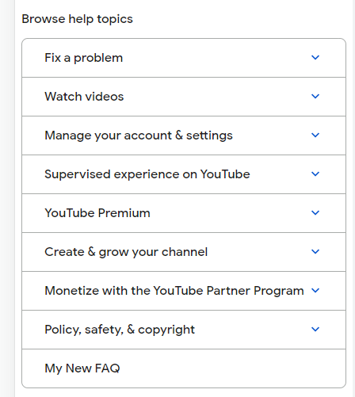

3. Webiste Name: [Youtube Support](https://support.google.com/youtube/)

### Topics

    - Get Element By Id, Create Element, Create Text Node, Append Child

### Sample Image

### Tasks

     Add another FAQ 'My New FAQ' to the list

### Output

### code

    const questions = document.querySelector(".you");
         const section1 = document.createElement('section');
         section1.className="parent";
         const tag=document.createElement('h3');
         section1.appendChild(tag);
         tag.textContent='Question5';
         questions.appendChild(section1);
        
